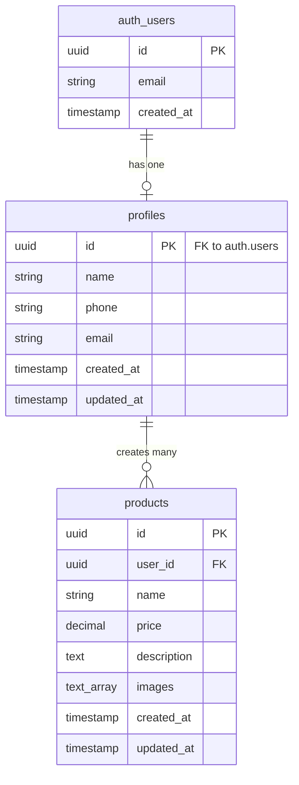

# Database Schema Documentation

## Overview

The Mini-Marketplace uses a PostgreSQL database hosted on Supabase with Row Level Security (RLS) enabled for all tables.

## Entity Relationship Diagram



## Tables

### auth.users (Managed by Supabase Auth)

This table is automatically managed by Supabase Authentication and stores core user authentication data.

**Key Fields:**
- `id` - Unique user identifier
- `email` - User's email address
- `created_at` - Account creation timestamp

### profiles

Stores additional user profile information linked to authenticated users.

**Schema:**
```sql
CREATE TABLE profiles (
  id UUID REFERENCES auth.users(id) ON DELETE CASCADE PRIMARY KEY,
  name TEXT NOT NULL,
  phone TEXT NOT NULL,
  email TEXT NOT NULL,
  created_at TIMESTAMPTZ DEFAULT NOW() NOT NULL,
  updated_at TIMESTAMPTZ DEFAULT NOW() NOT NULL
);
```

**Indexes:**
- `idx_profiles_email` on `email` column

**RLS Policies:**
- **SELECT**: Anyone can view all profiles (needed for seller information)
- **INSERT**: Users can only insert their own profile
- **UPDATE**: Users can only update their own profile

### products

Stores product listings created by users.

**Schema:**
```sql
CREATE TABLE products (
  id UUID DEFAULT uuid_generate_v4() PRIMARY KEY,
  user_id UUID REFERENCES profiles(id) ON DELETE CASCADE NOT NULL,
  name TEXT NOT NULL,
  price DECIMAL(10, 2) NOT NULL CHECK (price > 0),
  description TEXT NOT NULL,
  images TEXT[] NOT NULL CHECK (array_length(images, 1) > 0 AND array_length(images, 1) <= 5),
  created_at TIMESTAMPTZ DEFAULT NOW() NOT NULL,
  updated_at TIMESTAMPTZ DEFAULT NOW() NOT NULL
);
```

**Constraints:**
- `price` must be greater than 0
- `images` array must contain 1-5 items

**Indexes:**
- `idx_products_user_id` on `user_id` column
- `idx_products_created_at` on `created_at` column (descending)

**RLS Policies:**
- **SELECT**: Anyone can view all products
- **INSERT**: Only authenticated users can create products
- **UPDATE**: Users can only update their own products
- **DELETE**: Users can only delete their own products

## Storage

### product-images Bucket

Public storage bucket for product images.

**Structure:**
```
product-images/
└── {user_id}/
    └── {product_id}/
        ├── {timestamp}-0.jpg
        ├── {timestamp}-1.jpg
        └── ...
```

**Policies:**
- **SELECT**: Anyone can view images
- **INSERT**: Authenticated users can upload images
- **UPDATE**: Users can update their own images
- **DELETE**: Users can delete their own images

## Relationships

1. **auth.users → profiles** (1:1)
   - Each authenticated user has exactly one profile
   - Cascade delete: Deleting a user deletes their profile

2. **profiles → products** (1:N)
   - Each profile can have multiple products
   - Cascade delete: Deleting a profile deletes all their products

## Triggers

### update_updated_at_column

Automatically updates the `updated_at` timestamp whenever a record is modified.

**Applied to:**
- `profiles` table
- `products` table

## Security

### Row Level Security (RLS)

All tables have RLS enabled to ensure data security:

- **Public Read**: Products and profiles are publicly readable (marketplace requirement)
- **Authenticated Write**: Only logged-in users can create products
- **Owner-Only Modify**: Users can only modify/delete their own data
- **Automatic Ownership**: `user_id` is automatically set from `auth.uid()`

### Data Validation

- **Database Level**: CHECK constraints on price and images array
- **Application Level**: Zod schemas for form validation
- **File Upload**: Type and size validation before upload

## Queries

### Common Queries

**Get all products with seller information:**
```sql
SELECT 
  products.*,
  profiles.name as seller_name,
  profiles.phone as seller_phone
FROM products
JOIN profiles ON products.user_id = profiles.id
ORDER BY products.created_at DESC;
```

**Get products by user:**
```sql
SELECT * FROM products
WHERE user_id = 'user-uuid'
ORDER BY created_at DESC;
```

**Get user profile:**
```sql
SELECT * FROM profiles
WHERE id = 'user-uuid';
```

## Migration

The initial schema is defined in `supabase/migrations/001_initial_schema.sql`.

To apply the migration:
1. Open Supabase SQL Editor
2. Copy and paste the migration file contents
3. Execute the SQL

## Backup and Maintenance

- **Automatic Backups**: Supabase provides automatic daily backups
- **Point-in-Time Recovery**: Available on paid plans
- **Indexes**: Regularly monitor query performance and add indexes as needed
